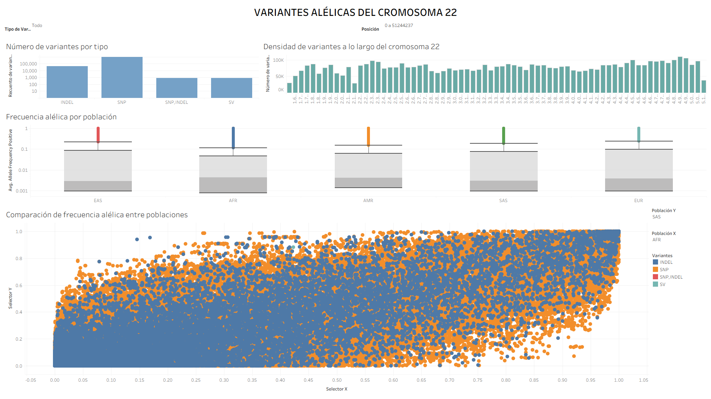

# Genomic Variants Dashboard


An exploratory bioinformatics workflow for chromosome 22 variants from the 1000 Genomes Project. It reads a compressed VCF, extracts population allele frequencies, writes analysis-ready CSV files, and generates plots for variant positions, alleles, variant types, and population frequencies. A Tableau workbook is also included for interactive exploration of the processed data.

## Project Goal

Transform chromosome 22 variant records into a tidy dataset for exploratory analysis, compare allele-frequency distributions across five populations, and prepare tabular data for visualization in Python and Tableau.

Populations represented:

* East Asian (EAS)
* African (AFR)
* Admixed American (AMR)
* South Asian (SAS)
* European (EUR)

## Project Structure

```text
genomic_variants_dashboard/
│
├── data/
│   ├── raw/                         # Source VCF (local, not tracked by Git)
│   └── processed/                   # Generated CSVs and Tableau workbook
│
├── results/
│   ├── figures/                     # EDA figures (.png)
│   └── dashboard/                   # Tableau dashboard preview (.png)
│
├── scripts/
│   └── setup.ps1                    # uv and pre-commit bootstrap
│
├── src/
│   └── variantes_genomicas/
│       ├── EDA.py                  # Loads processed data and creates figures
│       └── explore_vcf.py          # Reads VCF, extracts INFO fields, exports CSVs
│
├── tests/                           # pytest tests
├── pyproject.toml                   # Dependencies, Ruff, and pytest configuration
├── uv.lock                          # Locked dependency versions
└── README.md
```

The raw VCF and generated CSV files are excluded from Git because of their size. The Tableau workbook is included in the repository, while the processed CSV files must be generated locally before opening the workbook.

Generated figures are saved under `results/figures/`, and a preview of the Tableau dashboard is available under `results/dashboard/`.

## Quick Start

### 1. Clone the repository

```bash
git clone https://github.com/moralesgomez-dev/genomic-variants-dashboard.git

cd genomic-variants-dashboard
```

### 2. Create the environment

Install [uv](https://docs.astral.sh/uv/), then synchronize the locked dependencies and development tools:

```bash
uv sync --all-extras
```

Activate the environment:

```powershell
# Windows PowerShell
.\.venv\Scripts\Activate.ps1
```

```bash
# macOS / Linux
source .venv/bin/activate
```

### 3. Add the source VCF

Obtain the chromosome 22 Phase 3 VCF from the 1000 Genomes Project and place it in `data/raw/` with this filename:

```text
ALL.chr22.phase3_shapeit2_mvncall_integrated_v5b.20130502.genotypes.vcf.gz
```

This large input file is intentionally not committed to the repository.

### 4. Run the workflow

Both scripts resolve their default data and output paths from their source locations, so they can be run from any current working directory.

Run VCF processing first, followed by EDA:

```bash
python src/variantes_genomicas/explore_vcf.py

python src/variantes_genomicas/EDA.py
```

The first script writes processed files to `data/processed/`; the second reads `final_variants_chr22.csv` and saves the figures to `results/figures/`.

To use a different VCF or output directory, pass `--input-vcf` and `--output-dir` to `explore_vcf.py`.

## Pipeline Overview

### VCF processing

`explore_vcf.py`:

* Reads the VCF header and uses its `#CHROM` row for column names; compressed `.gz` input is supported.
* Retains chromosome, position, reference and alternate alleles, quality, filter, format, ID, and INFO data.
* Extracts `EAS_AF`, `AMR_AF`, `AFR_AF`, `EUR_AF`, `SAS_AF`, and `VT` from INFO.
* Allele-frequency fields are converted to numeric values; unavailable values become missing data.
* Writes these files to `data/processed/`:

  * `variants_chr22.csv` - retained VCF fields, including INFO.
  * `info_chr22.csv` - extracted population frequencies and variant type.
  * `final_variants_chr22.csv` - merged, one-row-per-variant dataset used by EDA.
  * `tableau_variants_chr22.csv` - long-form population/frequency table.
  * `tableau_variants_chr22_with_variant_id.csv` - the same long-form table with a stable `VariantID` shared across the five population rows for each variant.

### Exploratory figures

`EDA.py` creates the following existing figures; it does not alter the input data:

* `POS_Distribution.png` - chromosome position distribution in megabases.
* `REF_count.png` and `ALT_count.png` - the 15 most frequent reference and alternate alleles.
* `EAS_Distribution.png`, `AFR_Distribution.png`, `AMR_Distribution.png`, `SAS_Distribution.png`, and `EUR_Distribution.png` - allele-frequency histograms. Frequencies span 0 to 1; the log scale is applied to variant counts, not to frequency values.
* `VT_frecuency.png` - counts by variant type from the VCF INFO field.
* `boxplot.png` - population frequency boxplots, zoomed to 0-1.5% so quartiles and whiskers are legible. Individual outlier markers are hidden to avoid overplotting.
* `violinplot.png` - population frequency distributions, zoomed to 0-5%. Values above the displayed range are clipped in this view, not removed from the data.

## Tableau Dashboard

The project also includes an interactive Tableau dashboard built from the processed chromosome 22 variant data.

The dashboard provides an interactive overview of the genomic variants and allows the user to explore the dataset through several visualizations and filters.

### Dashboard visualizations

The dashboard includes:

* **Number of variants by variant type** - shows the distribution of variants according to their variant type (`VT`).
* **Variant density along chromosome 22** - visualizes how variants are distributed across the chromosome according to their genomic position (`POS`).
* **Allele frequency by population** - shows the allele-frequency distribution for EAS, AFR, AMR, SAS, and EUR.
* **Allele-frequency comparison between populations** - allows allele frequencies to be compared across the five populations.

### Interactive filters

The dashboard includes two interactive filters:

* **Variant type (`VT`)** - filters the dashboard according to the selected variant type.
* **Position (`POS`)** - filters variants according to their position along chromosome 22.

### Dashboard preview



The Tableau workbook is included in the repository:

```text
data/processed/Libro1.twb
```

To use the interactive dashboard:

1. Generate the processed CSV files by running `explore_vcf.py`.
2. Open `data/processed/Libro1.twb` with Tableau Desktop.
3. Keep the Tableau workbook in the same directory as the processed CSV files, since the workbook uses relative paths for its text connections.
4. Open the dashboard and use the `VT` and `POS` filters to explore the data interactively.

Tableau Desktop is required to open and interact with the workbook. An online Tableau Public version is not currently available.

## Dataset Snapshot

The locally processed `final_variants_chr22.csv` contains 1,103,547 variant rows.

Each of the five population-frequency columns has 6,348 missing values (about 0.58%). These are kept as missing rather than treated as zero.

Values in the allele-frequency fields range from 0 to 1.

## Data for Tableau

The Tableau dashboard uses the processed CSV files generated by `explore_vcf.py`.

In particular, the long-form dataset:

```text
tableau_variants_chr22_with_variant_id.csv
```

contains the population and allele-frequency information in a format suitable for Tableau.

Each variant has a stable `VariantID`, which is shared across its five population rows. This allows population frequencies to be compared while maintaining the relationship between the same genomic variant across populations.

## Tableau Workbook

`data/processed/Libro1.twb` is the Tableau Desktop workbook used with the processed CSVs.

The workbook uses relative paths for its text connections. Therefore, the workbook should remain in the same directory as the processed CSV files.

The workbook is included in the repository, but the generated CSV data is not tracked by Git due to its size.

To recreate the Tableau data, run:

```bash
python src/variantes_genomicas/explore_vcf.py
```

before opening the workbook.

Tableau Desktop is required to open and interact with the workbook.

## Development and Tests

Development dependencies include pytest, Ruff, pre-commit, and ipykernel.

The repository's CI workflow is configured to run Ruff and pytest:

```bash
ruff check .

python -m pytest
```

The tests use small synthetic VCF files and do not require the full chromosome dataset.

## Current Limitations

* The raw VCF and generated CSV files are ignored by Git; users must obtain the VCF and regenerate the CSVs locally.
* The Tableau workbook is included in the repository, but an online Tableau Public version is not currently available.
* Tableau Desktop is required to interact with the dashboard.
* Processing the complete VCF can require substantial memory because genotype columns are read before the project selects the variant fields it needs.

## Author

[moralesgomez-dev](https://github.com/moralesgomez-dev)
